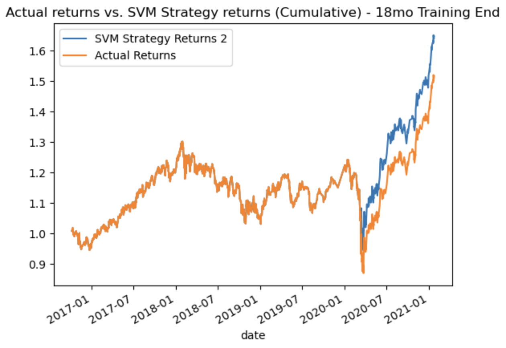

# Machine Learning Trading Bot

## Resources

* [Code File](Starter_Code/machine_learning_trading_bot.ipynb)
* [Seed Data](Starter_Code/Resources/emerging_markets_ohlcv.csv)

## Objective

* Implement an algorithmic trading strategy that uses machine learning to automate the trade decisions.

* Adjust the input parameters to optimize the trading algorithm.

* Train a new machine learning model and compare its performance to that of a baseline model.

## Analysis

After building the first algorithm, precision for both a buy and sell signal were fairly low. A buy signal had very strong recall at 0.96 but a sell signal had very low recall at 0.04.  The overall accuracy of the algorithm was only 55% accurate.  With only a 7% f1-score for the sell signal, this algorithm isn't very helpful to a trader.

**Classification Report:**

|         | precision|  recall  | f1-score| support   |
| ------- | -------- | ---------| --------| --------- |
| Sell    |   0.43   |   0.04   |  0.07   |   1804    | 
| Buy     |   0.56   |   0.96   |  0.71   |   2288    |
|  accuracy |        |          |  0.55   |   4092    |
| macro avg    | 0.49|   0.50   |  0.39   |   4092    |
| weighted avg | 0.50|   0.55   |  0.43   |   4092    |

In an attempt to tune the algorithm, I attempted to adjust the size of the training dataset through slicing the data into different periods.  I extended the Training End to 18months instead of 3months as referenced in the first algorithm.  By increasing the training window, I saw an elevation in precision for the sell signal but recall dropped to 0.00.  With a 0% f1-score for the sell signal this model is not advisable for the trader.  Even though accuracy improved to 56% with a 1.00 recall on the buy signal, this algorithm did not prove successful.  One interesting note is that the support data points dropped pretty significantly by 800 when extending the window. 

**Classification Report:**

|         | precision|  recall  | f1-score| support   |
| ------- | -------- | ---------| --------| --------- |
| Sell    |   0.75   |   0.00   |  0.00   |   1430    | 
| Buy     |   0.56   |   1.00   |  0.72   |   1843    |
|  accuracy |        |          |  0.56   |   3273    |
| macro avg    | 0.66|   0.50   |  0.36   |   3273    |
| weighted avg | 0.64|   0.56   |  0.41   |   3273    |

In an attempt to tune the algorithm in a different format, I attempted to adjust the SMA input features. I altered the SMA short-window to 1 day, instead of 4, and adjusted the long-window to 20, instead of 100 (4/100 to 1/20). 

By adjusting both SMA windows, I saw an elevation in recall and f1-score for the sell signal but a slight dip in recall and f1-score for the buy signal. Even though this model has a weaker buy signal recall and f1-score, I would recommend using this algorithm out of the three options shown due to having signals for both sell and buy.  Without having a sell signal, a stock trader would hold stocks continually without the ability to sell. 

**Classification Report:**

|         | precision|  recall  | f1-score| support   |
| ------- | -------- | ---------| --------| --------- |
| Sell    |   0.42   |   0.10   |  0.16   |   1826    | 
| Buy     |   0.56   |   0.89   |  0.69   |   2321    |
|  accuracy |        |          |  0.54   |   4147    |
| macro avg    | 0.49|   0.50   |  0.42   |   4147    |
| weighted avg | 0.50|   0.54   |  0.46   |   4147    |

Adjusting the SMA had a stronger effect on the algorithm results than slicing the data to a different range.  Doing this improved the sell signal recall, and f1-score, allowing for signal identification across both buy and sell signals. 

In a final attempt to produce stronger results, I chose a new model to evaluate performance.  Using the logarithmic regression analysis instead of SVM, I was able to see a large improvement in recall and f1-score for the sell signal, but a pretty large decrease in recall and f1-score for the buy signal.   Even with these unwanted changes in the buy signal, I believe this is a stronger model due to ability to signal both buy and sell.  With an improvement to 0.33 recall on the sell signal, this is a large improvement from 0.04 and 0.10.  I believe this model performed better than both the baseline and the tuned model. 

**Classification Report:**
|         | precision|  recall  | f1-score| support   |
| ------- | -------- | ---------| --------| --------- |
| Sell    |   0.44   |   0.33   |  0.38   |   1804    | 
| Buy     |   0.56   |   0.66   |  0.61   |   2288    |
|  accuracy |        |          |  0.52   |   4092    |
| macro avg    | 0.50|   0.50   |  0.49   |   4092    |
| weighted avg | 0.51|   0.52   |  0.51   |   4092    |

